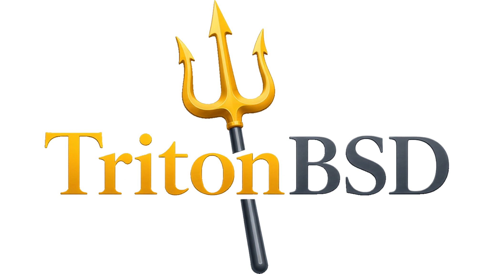

<h1 align="center">
  
</h1>

TritonBSD is a desktop operating system built on FreeBSD, combining the FreeBSD
base system with a modern Hyprland + QuickShell desktop and a streamlined
installation experience.

The current base is FreeBSD 15.1-RELEASE, built from the `releng/15.1` source
branch.

## Status

TritonBSD currently boots into a working live desktop with Hyprland,
QuickShell, Wi-Fi, and Ethernet support.

`triton-install` is currently a non-destructive installer prototype. The next
major milestone is the separately reviewed backend that installs the live
environment as a persistent TritonBSD system.

## How It Works

TritonBSD consists of two parts:

- **Live image** — bootable installation media containing the TritonBSD desktop
  environment and `triton-install`.
- **Installed system** — the persistent TritonBSD operating system installed to
  disk, using the same desktop environment and system configuration.

The image itself is built using the FreeBSD release infrastructure:

1. Fetch the FreeBSD source for the target release.
2. Build the standard FreeBSD release media.
3. Apply the TritonBSD packages, configuration, and desktop environment.
4. Boot into the TritonBSD live system and install it with `triton-install`.

See [`docs/how-it-works.md`](docs/how-it-works.md) for the system architecture and
[`docs/github-actions.md`](docs/github-actions.md) for build automation notes.
